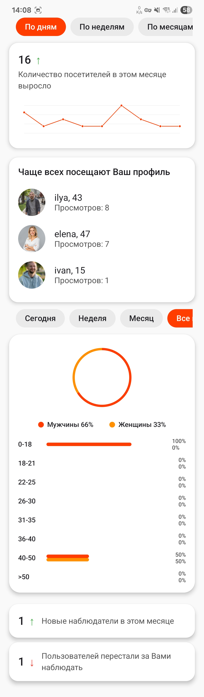
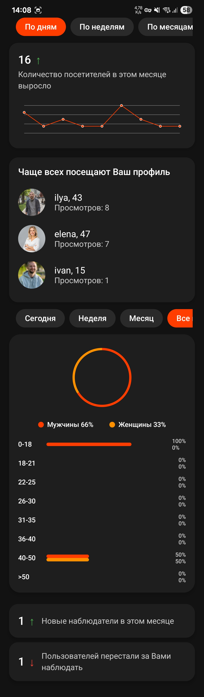

# 📊 RIK Statistics App

Android-приложение для отображения пользовательской статистики: просмотров, наблюдателей и распределения по полу и возрасту. Интерфейс и поведение реализованы по макету из Figma с высокой точностью (см. ниже ⬇️).

---

## 🚀 Стек технологий

- 🧱 **Jetpack Compose** — современная декларативная UI-система
- 🧠 **MVVM** — архитектура с ViewModel и state-based UI
- 🧪 **Kotlin** + `StateFlow` + `remember` — реактивное управление состоянием
- 🌐 **Ktor** — сетевые запросы к API
- 🖼️ **Coil** — загрузка изображений
- 🔗 **Compose Navigation** — навигация по экрану
- 🎨 **Поддержка светлой и тёмной темы**

---

## 🎯 Реализованный функционал

### 📈 График посещений
- Переключение по дням / неделям / месяцам
- Адаптивный line chart с кастомной отрисовкой:
    - Сетка, точки и дуги
    - Пунктирная линия и tooltip при нажатии

### 👥 Топ посетителей
- Отображение аватарки, имени, возраста и количества просмотров
- UI карточек строго по макету

### 📊 Пол и возраст
- Круговая диаграмма с распределением пола
- Горизонтальные полоски по возрастным группам (две на каждую — M/W)
- Таб-переключатель по временному периоду (сегодня, неделя, месяц, всё время)

### 👤 Наблюдатели
- Количество новых / отписавшихся за месяц
- Цветовые индикаторы ↑ / ↓

---

## 📷 Скриншоты

| Светлая тема                    | Тёмная тема                   |
|---------------------------------|-------------------------------|
|  |  |

